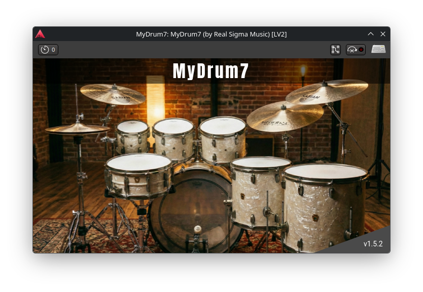

# MyDrum7


**MyDrum7** não é apenas mais um plugin. É uma resposta à escassez de instrumentos virtuais acústicos de qualidade nativos para o nosso sistema.

Projetado para produtores e músicos que, assim como eu, estão cansados de depender de "pontes", emuladores e softwares instáveis para conseguir um som de bateria decente. MyDrum7 é Linux puro, código eficiente e som orgânico.

<p align="center">
  
  <br>
  
  <br>
  
</p>

Este projeto nasceu de uma revolta pessoal. Como usuário de Linux, eu estava frustrado com a falta de opções nativas que entregassem realismo sem exigir configurações complexas de Wine ou bridges VST que "quebram" no meio da sessão.

Nós temos o melhor Kernel, o melhor sistema de arquivos e a melhor comunidade. Merecemos instrumentos à altura.

O MyDrum7 foi escrito em C++ moderno para rodar nativamente no seu Arch, Debian, Fedora ou Ubuntu, extraindo a máxima performance da sua máquina sem "camadas de tradução".

## Funcionalidades "Sem Gambiarras"

* **100% Nativo:** Esqueça o Wine. Esqueça o yabridge. Instale e toque.
* **Dinâmica Realista:** Múltiplas camadas de velocidade *(Velocity Layers)* para cada peça. O timbre muda organicamente, não apenas o volume.
* Anti-Metralhadora **(Round Robin):** Sistema inteligente que alterna amostras para evitar aquele som robótico e artificial em repetições rápidas.
* **Multicanal Real** (12 Saídas): Mixagem profissional. Jogue o Bumbo no canal 1, a Caixa no 3 e os Overheads no 11-12. Processe cada peça com seus plugins de EQ e compressão favoritos na DAW.
* **Motor de Hi-Hat:** Grupos de "Choke" implementados via código para cortar o som do chimbal aberto instantaneamente ao pisar no pedal.

<p align="center">
  
  <br>
  
</p>

## Instalação

1.  Baixe a versão mais recente na aba [**Releases**](https://github.com/realsigmamusic/mydrum7/releases).
2.  Extraia o arquivo compactado.
3.  Mova a pasta para o diretório de plugins do seu usuário:
    ```bash
    mkdir -p ~/.lv2
    mv mydrum7.lv2 ~/.lv2/
    ```
4.  Abra sua DAW favorita (Ardour, Reaper, Qtractor, etc.) e busque por **MyDrum7**.

> **Nota:** Para instalar para todos os usuários do sistema, mova a pasta para `/usr/lib/lv2/` (requer privilégios de root).

---

## Roteamento de Áudio (Canais)

Para obter a melhor mixagem, roteie as saídas do plugin para trilhas de áudio mono/estéreo na sua DAW. O plugin expõe 12 portas de saída:

| Porta     | Peça / Microfone | Descrição                                 |
| --------: | :--------------- | :---------------------------------------- |
| **1**     | **Kick In**      | Microfone interno do Bumbo (Ataque/Click) |
| **2**     | **Kick Out**     | Microfone externo do Bumbo (Peso/Sub)     |
| **3**     | **Snare Top**    | Microfone superior da Caixa               |
| **4**     | **Snare Bottom** | Microfone da esteira da Caixa             |
| **5**     | **Hi-Hat**       | Microfone direto do Chimbal               |
| **6**     | **Rack Tom 1**   | Tom Agudo                                 |
| **7**     | **Rack Tom 2**   | Tom Médio                                 |
| **8**     | **Rack Tom 3**   | Tom Grave                                 |
| **9**     | **Floor Tom 1**  | Surdo 1                                   |
| **10**    | **Floor Tom 2**  | Surdo 2                                   |
| **11-12** | **Overheads**    | Microfones de ambiente (Par Estéreo L/R)  |

## Mapa MIDI

O MyDrum7 segue um mapeamento intuitivo, compatível com a norma GM (General MIDI) em muitas peças, facilitando o uso com baterias eletrônicas e controladores.

## Créditos e Tecnologia

Este projeto foi construído sobre ombros de gigantes, utilizando tecnologias open-source de ponta para áudio.

* **Samples:** A alma deste plugin são as amostras de áudio de alta qualidade fornecidas gentilmente por [**Tchackpoum**](https://www.tchackpoum.com/). Visite o site para conhecer mais sobre o trabalho deles.
* **Tecnologias:**
    * **LV2:** O padrão aberto para plugins de áudio no Linux.
    * **C++:** Utilizado para máxima performance e baixa latência no processamento de sinal (DSP).
    * **libsndfile:** Para leitura e decodificação de áudio de alta fidelidade.

---
*Desenvolvido com amor, ~~ódio~~, e café no Arch Linux.* 🐧