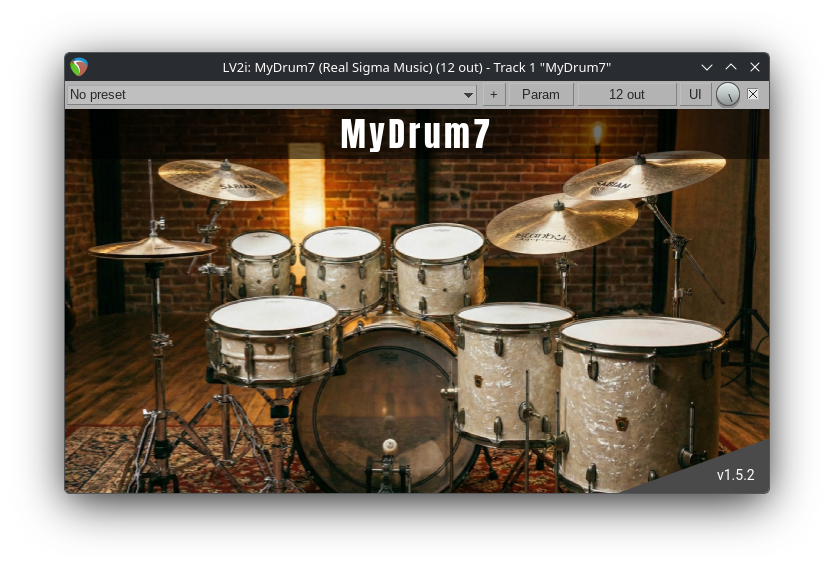
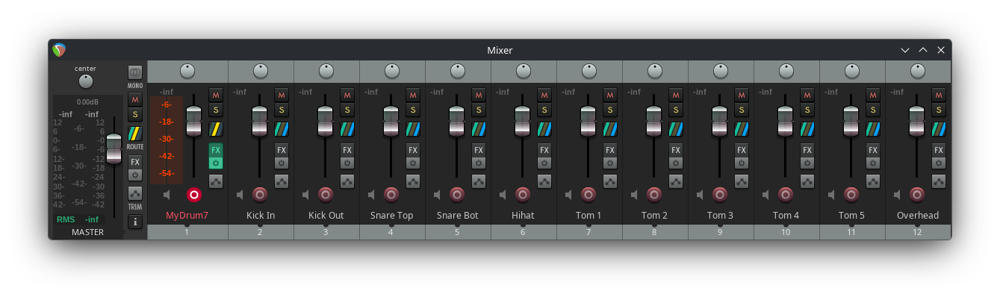
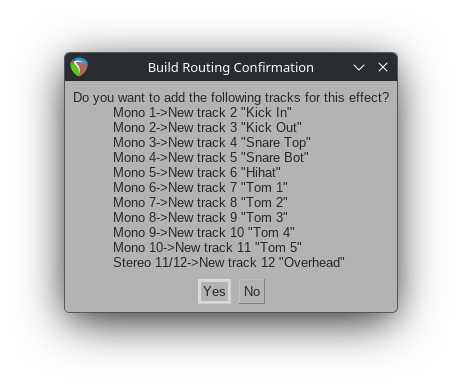
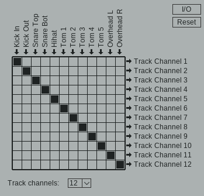

# MyDrum7

**MyDrum7** é um plugin de bateria acústica virtual de alta fidelidade no formato LV2. Projetado para produtores e músicos que buscam uma sonoridade orgânica e realista em suas produções no Linux.

Este instrumento virtual combina a performance da linguagem C++ com uma biblioteca de sons meticulosamente gravada, oferecendo dinâmica e expressividade comparáveis a softwares comerciais de ponta.

<p align="center">
  
  <br>
  
</p>

## Funcionalidades

*   **Dinâmica Realista:** Múltiplas camadas de velocidade (Velocity Layers) para cada peça da bateria. O timbre muda naturalmente dependendo da força com que a nota é tocada.
*   **Round Robin (RR):** Sistema inteligente que alterna entre diferentes amostras para a mesma nota e intensidade, eliminando o efeito robótico ("metralhadora") em repetições rápidas.
*   **Saídas Múltiplas (Multi-Output):** O plugin oferece 12 canais de áudio independentes, permitindo que você mixe o Bumbo, Caixa, Tons e Overheads em faixas separadas na sua DAW, exatamente como faria com uma gravação de bateria real.
*   **Motor de Hi-Hat Avançado:** Inclui grupos de "Choke" para cortar o som do chimbal aberto quando o pedal é pressionado, garantindo uma performance autêntica.

<p align="center">
  
  <br>
  
</p>

## Instalação

1.  Baixe o pacote do plugin.
2.  Extraia a pasta `mydrum7.lv2`.
3.  Mova a pasta para o diretório de plugins do seu usuário:
    ```bash
    mkdir -p ~/.lv2
    mv mydrum7.lv2 ~/.lv2/
    ```
4.  Abra sua DAW favorita (Ardour, Reaper, Qtractor, etc.) e busque por "MyDrum7".

## Roteamento de Áudio (Canais)

Para obter a melhor mixagem, roteie as saídas do plugin para trilhas de áudio mono/estéreo na sua DAW:

| Porta | Microfone / Peça | Descrição |
| :--- | :--- | :--- |
| **1** | Kick In | Microfone interno do Bumbo (Ataque) |
| **2** | Kick Out | Microfone externo do Bumbo (Peso) |
| **3** | Snare Top | Microfone superior da Caixa |
| **4** | Snare Bottom | Microfone da esteira da Caixa |
| **5** | Hi-Hat | Microfone direto do Chimbal |
| **6-8** | Rack Toms 1-3 | Tons de ataque |
| **9-10** | Floor Toms 1-2 | Surdos |
| **11-12** | Overheads (L/R) | Microfones de ambiente (Estéreo) |

## Mapa MIDI

O MyDrum7 segue um mapeamento intuitivo, compatível com a maioria dos controladores MIDI:

### Bumbo & Caixa
*   **35, 36:** Bumbo (Kick)
*   **38:** Caixa Centro (Snare Center)
*   **37:** Caixa Sidestick
*   **39:** Caixa Borda (Edge)
*   **40:** Caixa Rimshot

### Chimbal (Hi-Hat)
*   **42:** Fechado (Bow)
*   **29:** Fechado (Edge)
*   **44:** Pedal Fechado (Chick)
*   **46:** Aberto (Bow)
*   **30-34:** Aberto (Edge - vários níveis de abertura)
*   **23:** Pedal Splash

### Tons & Pratos
*   **48, 47, 45, 43, 41:** Tons (do mais agudo ao mais grave)
*   **49, 52:** Crash 1 (Bow/Edge)
*   **55, 57:** Crash 2 (Bow/Edge)
*   **51, 53, 59:** Ride (Corpo, Cúpula, Borda)

## Créditos e Tecnologia

Este projeto foi construído sobre ombros de gigantes, utilizando tecnologias open-source de ponta para áudio.

*   **Samples:** A alma deste plugin são as amostras de áudio incríveis fornecidas por [**Tchackpoum**](https://www.tchackpoum.com/). 
*   **Tecnologias:**
    *   **LV2:** O padrão aberto para plugins de áudio no Linux.
    *   **C++:** Para máxima performance e baixa latência.
    *   **libsndfile:** Para leitura de áudio de alta fidelidade.